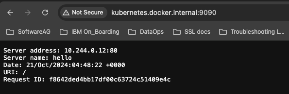

# How to Test Ingress in a kind cluster.


#### Deploy the nginx-ingress controller and wait for it to be ready by running:
```
kubectl apply --filename https://raw.githubusercontent.com/kubernetes/ingress-nginx/controller-v1.0.0/deploy/static/provider/baremetal/deploy.yaml

kubectl wait --namespace ingress-nginx \
  --for=condition=ready pod \
  --selector=app.kubernetes.io/component=controller \
  --timeout=90s
```

#### Create a kubernetes service and ingress:

The below command will create a pod and service for us.
```
kubectl run hello \
  --expose \
  --image nginxdemos/hello:plain-text \
  --port 80
```


#### Then create an Ingress resource that directs traffic for kubernetes to the hello service by creating a file named ingress.yaml with the following content:
```
apiVersion: networking.k8s.io/v1
kind: Ingress
metadata:
  name: hello
spec:
  rules:
    - host: kubernetes.docker.internal
      http:
        paths:
          - pathType: ImplementationSpecific
            backend:
              service:
                name: hello
                port:
                  number: 80
```


#### Deploy the Ingress resource by running:
```
kubectl create --filename ingress.yaml
```

Then add an entry to /etc/hosts with the IP address found that looks like:

```
127.0.0.1	localhost	kubernetes.docker.internal
```

Finally, we can curl <ins>kubernetes.docker.internal</ins> on port 80 but it will not work as Kind Cluster is setup to access http on port "9090" and https on "9443". Hence we need to add "9090" port number in the URL other wise connection will fail.


This is how we reachout to the pod:
```
curl -k http://kubernetes.docker.internal:9090/
Server address: 10.244.0.12:80
Server name: hello
Date: 21/Oct/2024:04:44:14 +0000
URI: /
Request ID: 1fc382c5e5b264533c3e54c2059faa0b
```


